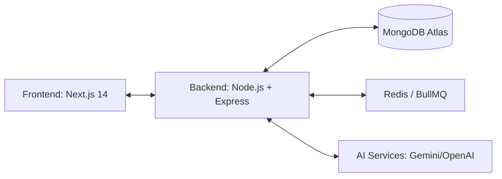

# Professional Internal Management System (IMS)

A comprehensive, production-ready, white-labeled solution for managing organizational operations. Built with a modern tech stack and enhanced with AI capabilities.

---

## 🏗️ Architecture



---

## ✨ Key Features

- **🛡️ White-Labeling & Dynamic Branding**: Fully customizable branding via system settings. Update logos, colors, and names across the platform without code changes.
- **🤖 AI-Powered Intelligence**:
  - **Dashboard Insights**: Real-time organizational health analysis.
  - **Project Intelligence**: Automated risk assessment and milestones tracking.
  - **AI Doc Chat**: Summarize and query documents directly from Google Drive or local uploads.
  - **Magic Write**: AI-assisted email drafting and professional communication tools.
- **💼 HRMS & Operations**:
  - Employee lifecycle management (Recruitment, Onboarding, Payroll).
  - Attendance tracking with geo-fencing and MFA security.
  - Advanced financial reporting with soft-delete data integrity.
- **📁 Integrated File Management**: Native support for Google Drive and Cloudinary for enterprise-grade document sharing.
- **💬 Real-Time Collaboration**: Instant chat and system-wide notifications powered by Socket.IO.

---

## 🚀 Quick Start

### 1. Backend Setup (`ims-platform/backend/`)
1. **Configure Environment**:
   ```bash
   cp .env.example .env
   ```
   *Required variables*: `MONGO_URI`, `JWT_SECRET`, `CLIENT_URL` (e.g., `http://localhost:3000`).
2. **Install & Initialize**:
   ```bash
   npm install
   npm run seed    # Initialize system settings and default admin
   ```
3. **Start Server**:
   ```bash
   npm start       # Runs on http://localhost:5000
   ```

### 2. Frontend Setup (`ims-platform/frontend/`)
1. **Configure Environment**:
   ```bash
   cp .env.example .env.local
   ```
   *Required variables*: `NEXT_PUBLIC_API_URL`, `NEXT_PUBLIC_SOCKET_URL`.
2. **Install & Run**:
   ```bash
   npm install
   npm run dev     # Runs on http://localhost:3000
   ```

---

## 🔐 Role-Based Access Control

| Role | Permissions |
|------|-------------|
| **Admin** | Full system control, branding management, and audit logs. |
| **HR** | Recruitment, Payroll, Leave Management, and Employee records. |
| **Manager** | Project oversight, Team assignments, and Task validation. |
| **Employee** | Personal dashboard, Task updates, Attendance, and Internal Chat. |

---

## 🌐 Deployment & Security

- **Security**: Helmet, Rate Limiting, JWT Auth, and MFA support.
- **Monitoring**: Integration-ready with Sentry for error tracking.
- **Cloud-Ready**: Optimized for deployment on Vercel/Render with environment-driven configurations.

---

## 👤 Credits & Support
Developed for Enterprise Management Efficiency.
[GitHub Repository](https://github.com/Prince364133/IMS-SYSTEM)
